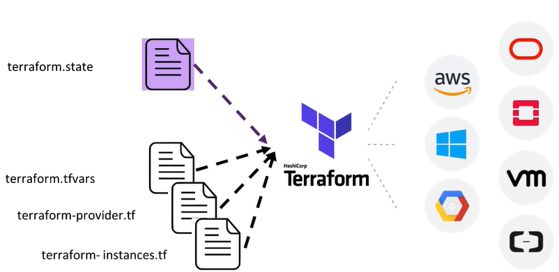

# Build Infrastructure - Terraform Azure Example

## Sumario

- [Build Infrastructure - Terraform Azure Example](#build-infrastructure---terraform-azure-example)
  - [Sumario](#sumario)
    - [O que é Terraform](#o-que-é-terraform)
    - [Instalando o Terraform](#instalando-o-terraform)
    - [Glossário Terraform](#glossário-terraform)
  - [Dose diária de Terraform](#dose-diária-de-terraform)
  - [Terraform: Melhores práticas](#terraform-melhores-práticas)
  - [HashiTalks Brasil](#hashitalks-brasil)
  - [Visual Studio Code](#visual-studio-code)
    - [Estrutura do arquivo `.tf`](#estrutura-do-arquivo-tf)
    - [Os estágios do Terraform](#os-estágios-do-terraform)
    - [Azure CLI](#azure-cli)
      - [Instalando o Azure CLI](#instalando-o-azure-cli)
    - [AzureRM](#azurerm)
    - [Provisionando o primeeiro recurso](#provisionando-o-primeeiro-recurso)
  - [Terraform Variáveis](#terraform-variáveis)
  - [Terraform (Funções, expressões e loops)](#terraform-funções-expressões-e-loops)
  - [Terraform State (Remote state)](#terraform-state-remote-state)
    - [Azure Blob Storage](#azure-blob-storage)
  - [Organização do Código do Terraform](#organização-do-código-do-terraform)
  - [Terraform (Módulos)](#terraform-módulos)
  - [Terraform Import](#terraform-import)


### O que é Terraform
Antes de começar precisamos tomar alguma ideia do que é o Terraform e qual é seu propósito dentro de DevOps e dentro do contexto de IaC (Infrastructure as Code). O Terraform é capaz de criar, provisionar, muda e versionar o estado de uma infraestrutura, muito  utilizado no mercado, multi-plataforma, e simples de aprender.


### Instalando o Terraform
Para que seja possível a utilização, temos que prosseguir com a instalação do Terraform, siga os comandos abaixo.

- Para sistemas baseados em Debian, como o Ubuntu:

```bash
$ wget -O- https://apt.releases.hashicorp.com/gpg | gpg --dearmor | sudo tee /usr/share/keyrings/hashicorp-archive-keyring.gpg
$ echo "deb [signed-by=/usr/share/keyrings/hashicorp-archive-keyring.gpg] https://apt.releases.hashicorp.com $(lsb_release -cs) main" | sudo tee /etc/apt/sources.list.d/hashicorp.list
$ sudo apt update && sudo apt install terraform
```

- Para mais sistemas operacionais como CentOS, MAC, use esse link [aqui](https://www.terraform.io/downloads).

### Glossário Terraform
[Esta](https://www.terraform.io/docs/glossary) página reúne breves definições de alguns dos termos técnicos usados na documentação do Terraform, bem como alguns termos que aparecem com frequência em conversas em toda a comunidade Terraform.

## Dose diária de Terraform
Existe um belissímo trabalho do [Anton Babenko](https://github.com/antonbabenko) na comunidade e gostaria de divulgar aqui com vocês. Vale demais asistir os vídeos e se inscrever no [canal](https://www.youtube.com/c/AntonBabenkoLive) dele no YouTube. Acompanhe também a página dele no [Twitter](https://twitter.com/weeklytf).

## Terraform: Melhores práticas
Para ajudar ainda mais esse guia sobre Terraform no Azure, vou reforçar com algumas boas práticas de Terraform ideais para cenários de mercado. Existe um [guia](https://www.terraform-best-practices.com/v/ptbr/) muito forte dentro da comunidade do Terraform escrito por [Anton Babenko](https://github.com/antonbabenko), e mantido pela comunidade como um todo. Este documento é uma tentativa de descrever sistematicamente as melhores práticas usando o Terraform, e, fornecer recomendações para os problemas mais frequentes de seus usuários.

Existe mais um outro site que fornece MUITAS informações úteis sobre as boas práticas com Terraform. Este documento apresenta diretrizes e recomendações para um desenvolvimento eficaz com o Terraform em vários membros da equipe e fluxos de trabalho. Acesse [aqui](https://cloud.google.com/docs/terraform/best-practices-for-terraform).

## HashiTalks Brasil
Um evento virtual para a comunidade HashiCorp do Brasil em 28 de julho de 2022. Fica ligado demais pessoal!! Acesse [aqui](https://www.youtube.com/watch?v=ITXVEUqlMWk&ab_channel=HashiCorp) o evento. Confira abaixo alguns dos temas do evento:

- **Providers utilitários do Terraform que podem facilitar suas tarefas do dia a dia**
Sabia que é possível gerar um .zip somente com Terraform? Ou que pode fazer uma requisição HTTP GET e usar a saída no seu código Terraform? Ou melhor, gerar nomes aleatórios para os recursos? Essa palestra vai mostrar casos de uso para alguns providers utilitários do Terraform que são ótimos de se ter na caixa de ferramentas na hora de resolver tarefas do dia a dia.

- **Promovendo entrega contínua com Terraform**
Demonstração do processo de entrega contínua utilizando o Terraform e Azure DevOps e como pode ser simples a administração e manutençãoda pipeline e Iac para o SRE , além de como é descomplicado para o desenvolvedor utilizar a pipeline.

- **CodeBuild, CodePipeline e conteinerizações com Terraform**
Vou falar um pouco sobre como o Terraform nos auxiliou a criar recursos na AWS de CodeBuild e CodePipeline que fazem parte do nosso processo de entrega e que ajudam a buildar nossas imagens de aplicações em Docker e gerenciá-las com ECR ou algum outro repositório, garantindo a preservação da infraestrutura, facilidade para construção de POCs, segurança no manuseio de chaves e agilidade para criar com complexidade.


## Visual Studio Code
Para facilitar o desenvolvimento com os arquivos HCL do Terraform, uma IDE muito utilizada pelos profissionais é o VSCode. Instale ele clicando [aqui](https://code.visualstudio.com/). Existe também uma extensão muito boa que ajuda demais na identação e na formatação dos arquivos do Terrafor, autocomplete e mais features. Baixei [aqui](https://marketplace.visualstudio.com/items?itemName=HashiCorp.terraform).


### Estrutura do arquivo `.tf`
Para que possamos ter uma ideia da linguagem usada pelo Terraform, chamada de HCL, vamos aos exemplos abaixo. Linguagem declarativa.

```hcl
terraform {
  required_providers {
    aws = {
      source  = "hashicorp/aws"
      version = "~> 3.0"
    }
  }
}

provider "aws" {
  region = var.region
}

resource "aws_instance" "tutorials" {
  ami           = var.ami
  instance_type = var.instance_type
}
```

### Os estágios do Terraform
O Terraform possui um estágio representado por alguns comandos que vou mostrar abaixo. Funciona como um workflow.

- `$ terraform init` - inicia o diretório de trabalho do Terraform, é a parte de baixar plugins dos provedores.
- `$ terraform plan` - estágio de planejamento da infraestrutura, parte que faz o provisionamento.
- `$ terraform apply` - executa o comando `apply` para que o ambiente seja criado e provisionado.
- `$ terraform destroy` - comando que faz a destruição dos recursos criados no provedor.

### Azure CLI
A principal ferramenta de linha de comando do Azure para gerenciar os diversos serviços.

#### Instalando o Azure CLI
A CLI do Azure é uma ferramenta de linha de comando multiplataforma que pode ser instalada localmente em computadores Linux. Você pode usar a CLI do Azure no Linux para se conectar ao Azure e executar comandos administrativos sobre os recursos do Azure. A CLI no Linux permite a execução de vários comandos por meio de um terminal usando prompts de linha de comando interativos ou um script. Vamos fazer a instalação direto no Linux Ubuntu. Para mais opções clique [aqui](https://docs.microsoft.com/pt-br/cli/azure/install-azure-cli).

- Instalar com um comando

`curl -sL https://aka.ms/InstallAzureCLIDeb | sudo bash`

### AzureRM
Um dos providers do Azure para uso dentro da nuvem pública do Azure. Mais detalhes [aqui](https://registry.terraform.io/providers/hashicorp/azurerm/latest/docs).

```hcl
terraform {
  required_providers {
    azurerm = {
      source = "hashicorp/azurerm"
      version = "3.15.1"
    }
  }
}

provider "azurerm" {
  # Configuration options
}
```

### Provisionando o primeeiro recurso
Hora de botar a mao na massa e ajustar nosso primeiro recurso na cloud da Azure. Siga as etapas abaixo:

- Primeiramente vamos logar na cloud da Azure via Azure CLI.

`$ az login`

- Executando o comando `terraform init`.

```bash
$ terraform init

Initializing the backend...

Initializing provider plugins...
- Finding hashicorp/azurerm versions matching "3.15.1"...
- Installing hashicorp/azurerm v3.15.1...
- Installed hashicorp/azurerm v3.15.1 (signed by HashiCorp)

Terraform has created a lock file .terraform.lock.hcl to record the provider
selections it made above. Include this file in your version control repository
so that Terraform can guarantee to make the same selections by default when
you run "terraform init" in the future.

Terraform has been successfully initialized!

You may now begin working with Terraform. Try running "terraform plan" to see
any changes that are required for your infrastructure. All Terraform commands
should now work.

If you ever set or change modules or backend configuration for Terraform,
rerun this command to reinitialize your working directory. If you forget, other
commands will detect it and remind you to do so if necessary.
```

- Agora vamos executar o plan.

```bash
 terraform plan

Terraform used the selected providers to generate the following execution plan. Resource actions are indicated with the following symbols:
  + create

Terraform will perform the following actions:

  # azurerm_resource_group.teste-group will be created
  + resource "azurerm_resource_group" "teste-group" {
      + id       = (known after apply)
      + location = "brazilsouth"
      + name     = "rgterraform"
    }

Plan: 1 to add, 0 to change, 0 to destroy.

───────────────────────────────────────────────────────────────────────────────────────────────────────────────────────────────────────────────────────────────────────────────────────────────────────────────────────── 

Note: You didn't use the -out option to save this plan, so Terraform can't guarantee to take exactly these actions if you run "terraform apply" now.
```

- E por ultimo o comando `terraform apply`.

```bash
$ terraform apply

Terraform used the selected providers to generate the following execution plan. Resource actions are indicated with the following symbols:
  + create

Terraform will perform the following actions:

  # azurerm_resource_group.teste-group will be created
  + resource "azurerm_resource_group" "teste-group" {
      + id       = (known after apply)
      + location = "brazilsouth"
      + name     = "rgterraform"
    }

Plan: 1 to add, 0 to change, 0 to destroy.

Do you want to perform these actions?
  Terraform will perform the actions described above.
  Only 'yes' will be accepted to approve.

  Enter a value: yes

azurerm_resource_group.teste-group: Creating...
azurerm_resource_group.teste-group: Creation complete after 4s

Apply complete! Resources: 1 added, 0 changed, 0 destroyed.

Note: Objects have changed outside of Terraform

Terraform detected the following changes made outside of Terraform since the last "terraform apply":

  # azurerm_resource_group.teste-group has been changed
  ~ resource "azurerm_resource_group" "teste-group" {
        id       = "/subscriptions/99a99sjsj777444os000ssss10101sss/resourceGroups/rgterraform"
        name     = "rgterraform"
      + tags     = {}
        # (1 unchanged attribute hidden)
    }

Unless you have made equivalent changes to your configuration, or ignored the relevant attributes using ignore_changes, the following plan may include actions to undo or respond to these changes.
```

## Terraform Variáveis
Usa-se muito variáveis dentro do Terraform para evitar replicação de código e mais outros pontos negativos durante o desenvolvimento do código, para isso siga as etapas abaixo:

```hcl
provider "azurerm" {
  features{}
}

variable "location" {
  type = string
  description = "Localizao dos recursos do Azure."
  default = "brazilsouth"
}

resource "azurerm_resource_group" "grupo-recurso" {
  name = "rg-variaveis"
  location = var.location
  
}
```

Podemos usar as variáveis em um arquivo separado para que tenhamos mais controle e melhor gerenciamento do que esta sendo tratado.


## Terraform (Funções, expressões e loops)
A linguagem Terraform inclui várias funções internas que você pode chamar de dentro de expressões para transformar e combinar valores. A sintaxe geral para chamadas de função é um nome de função seguido por argumentos separados por vírgulas entre parênteses.

`max(5, 12, 9)`

- Use o comando `$ terraform console` para checar mais detalhes:

```bash
$ terraform console
> max(5, 12, 9)
```

- Mais um exemplo de uso:

```bash
> format("Hello, %s!", "Ander")
Hello, Ander!
> format("There are %d lights", 4)
There are 4 lights
```

## Terraform State (Remote state)
Temos que armazenar o estado sempre em locais remotos para que mais pessoas possam colaborar com o Terraform. No Azure usamos alguns recursos legais que ajuda demais. Veja algumas vantagens de manter o remote state do Terraform.

- colaboração (mantemos esse arquivo seguro)
- suporte a multiplos backends
- mantemos o arquivo sempre protegido

No Azure usamos o Azure Storage para manter o state do nosso Terraform.



### Azure Blob Storage
Usamos de forma muito forte dentro do Azure, esse serviço é super econômico e usado em muitas integrações e sistemas. Para mais detalhes sobre esse serviço, consulte a documentação [aqui](https://azure.microsoft.com/pt-br/services/storage/blobs/#overview).

## Organização do Código do Terraform
Como estamos trabalhando com código é sempre bom seguir as boas práticas de organização, seja workspaces, ambiente de testes, módulos e mais opções. Focado no Terraform, temos que olhar a infraestrutura como código como um produto, ou seja, criar projetos completos, e que sirvam em outros cases.

Outro ponto legal de mencionar é criar a infraestrutura pensando no ambiente que vai tomar cada projeto, ou seja, ter os seguintes ambientes disponíveis:
 
- Desenvolvimento (usado para testes antes da aplicação final).
- Staging (usado para validação).
- Produção (provisionamento final dos recursos a serem aplicados).

Sempre que possível crie dentro desses ambiente difernetes tipos de arquivos para facilitar o entendimento e a utilização com os recursos do Terraform.

- **DEV** 
  - main.tf
  - variables.tf
  - main.tfvars

- **TEST**
  - main.tf
  - variables.tf
  - main.tfvars

- **PROD**
  - main.tf
  - variables.tf
  - main.tfvars

É um dos exemplos de organizar os arquivos do Terraform, mas a melhor forma é a que pretendo esclarecer nos próximos tópicos.

## Terraform (Módulos)


```terraform
module "consul" {
  source = "app.terraform.io/example-corp/k8s-clustr/azurerm"
  version = "0.0.2"
}
```

## Terraform Import
Recurso muito usado para que seja possivel importar uma infraestrutura pre-existente. Vamos criar um recurso no Azure (Virtual Network) e logo depois importar esse recurso para dentro do Terraform usando o comando `terraform import`.

1- Logo apos criar os recursos no portal do Azure, execute o comando abaixo:

`$ terraform state list`

2- Agora temos que executar outro comando do azure:

`$ az group list`

Esse comando deve fornecer mais detalhes sobre esse recurso que foi criado. Precisamos do ID para enviar junto com o comando do `terraform import`.

3- Agora temos que executar o comando de import. Primeiro crie o provider.

```terraform
provider "azurerm" {
 features {
 } 
}

resource "azurerm_resource_group" "rg" { 
}

resource "azurerm_virtual_network" "vnet" { 
}
```

- Agora execute o comando:

```bash
$ terraform import azurerm_resource_group.rg /subscriptions/2ekdkdkd-dsdksd-dsds-883jd-jdjsdjs-8sd8s8-dsdsd99-/rg-terraform-import
azurerm_resource_group.rg: Import prepared!
  Prepared azurerm_resource_group for import
azurerm_resource_group.rg: Refreshing state... [id=/subscriptions/2ekdkdkd-dsdksd-dsds-883jd-jdjsdjs-8sd8s8-dsdsd99-/rg-terraform-import]

Import successful!

The resources that were imported are shown above. These resources are now in
your Terraform state and will henceforth be managed by Terraform.
```

- Hora de importar mais um recurso que e o da VNET:

```bash
$ terraform import azurerm_virtual_network.vnet /subscriptions/subscriptions/2ekdkdkd-dsdksd-dsds-883jd-jdjsdjs-8sd8s8-dsdsd99-/rg-terraform-import/virtualNetworks/terraform-handson
azurerm_virtual_network.vnet: Importing from ID "/subscriptions/subscriptions/2ekdkdkd-dsdksd-dsds-883jd-jdjsdjs-8sd8s8-dsdsd99-/rg-terraform-import/providers/Microsoft.Network/virtualNetworks/terraform-handson"...
azurerm_virtual_network.vnet: Import prepared!
  Prepared azurerm_virtual_network for import
azurerm_virtual_network.vnet: Refreshing state... [id=/subscriptions/subscriptions/2ekdkdkd-dsdksd-dsds-883jd-jdjsdjs-8sd8s8-dsdsd99-/rg-terraform-import/providers/Microsoft.Network/virtualNetworks/terraform-handson]

Import successful!

The resources that were imported are shown above. These resources are now in
your Terraform state and will henceforth be managed by Terraform.
```

- Para que seja comprovado, execute mais esse comando. Veja que ele mostra mais outro recurso importado.

```bash
$ terraform state list
azurerm_resource_group.rg
azurerm_virtual_network.vnet
```